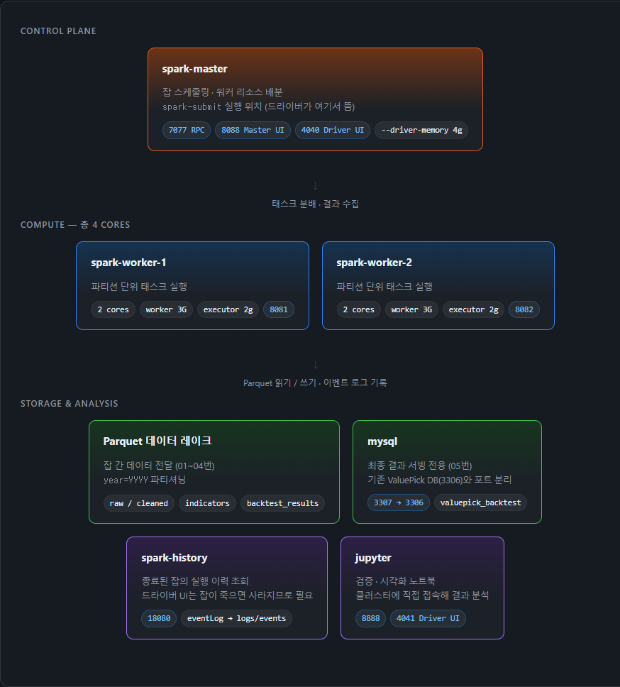
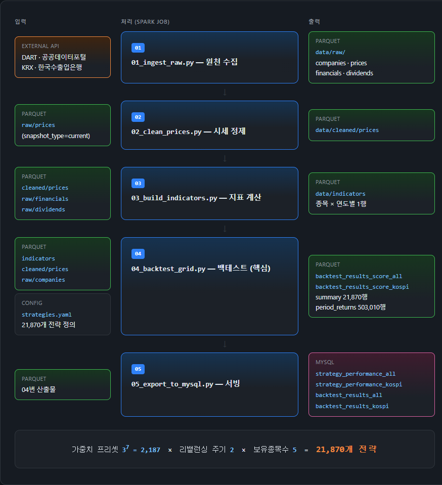
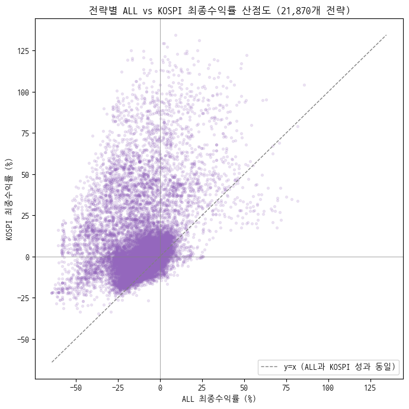
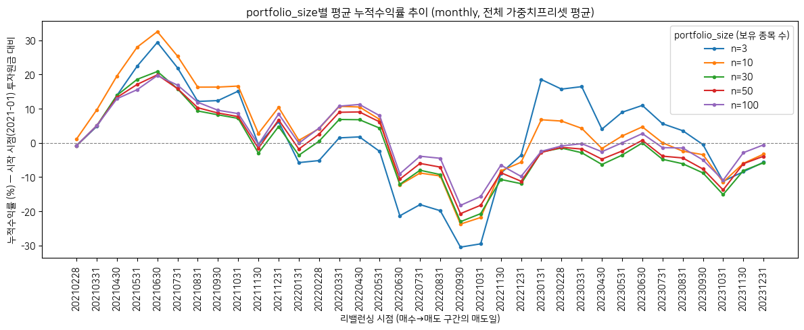
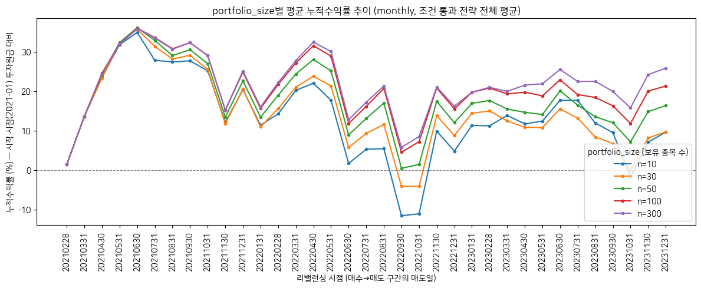
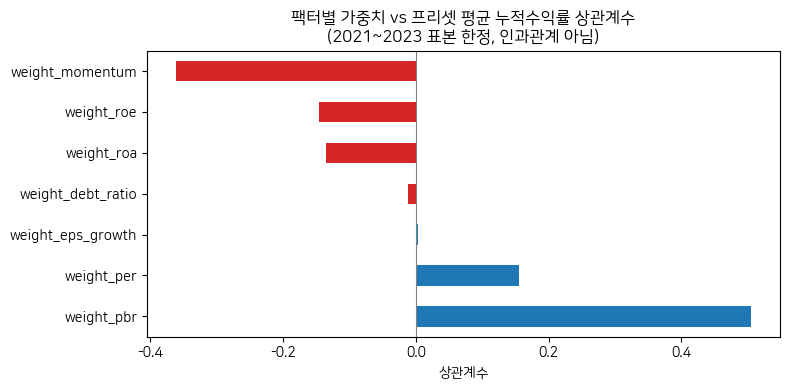
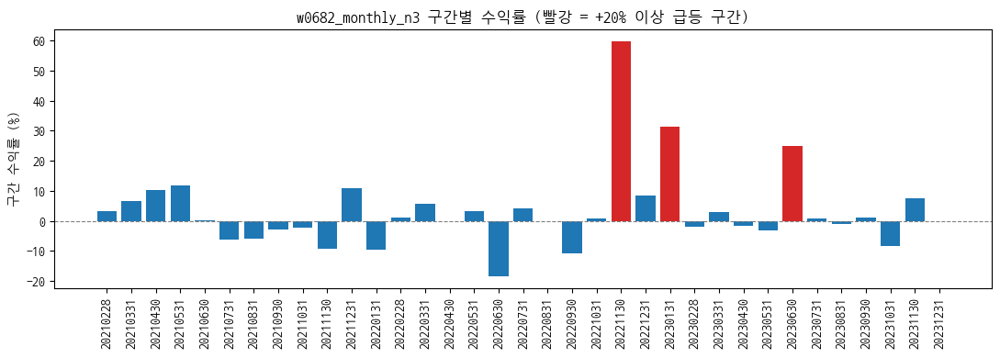
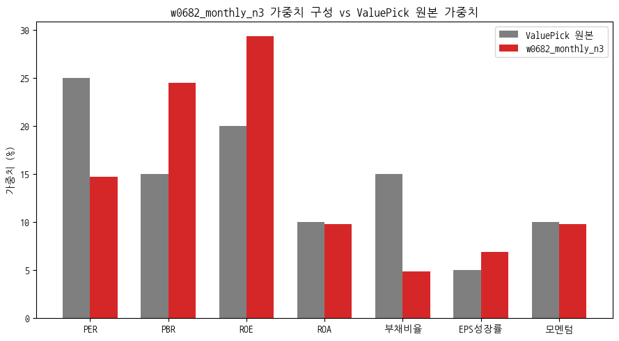
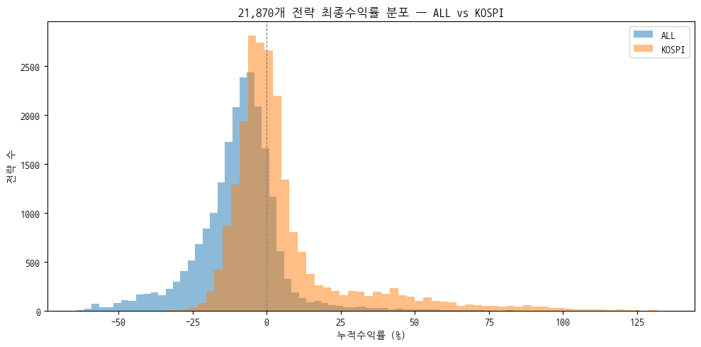
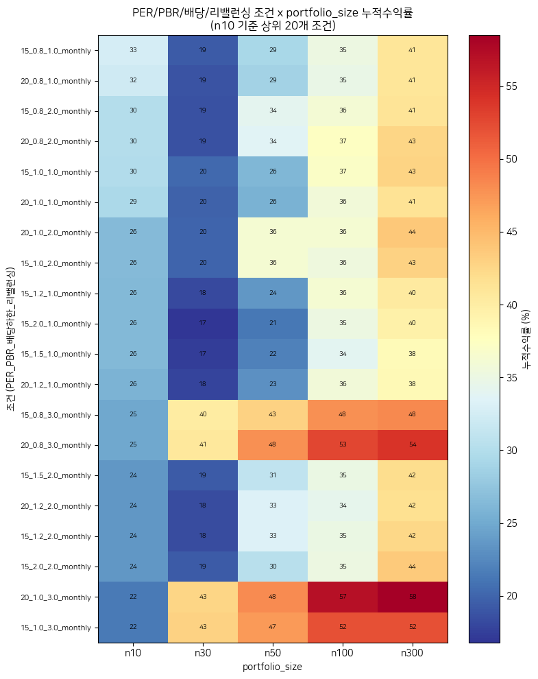

# valuepick-batch

**ValuePick 추천 로직은 실제로 수익을 냈을까?** — Apache Spark로 21,870개 전략을 동시에 백테스트해 검증한 파이프라인입니다.

기존 [ValuePick](https://github.com/project-valuepick/valuepick) 서비스가 운영 중인 종목 추천 로직(`Top100Service.scoreAll()` — 7팩터 백분위 가중합산)을 Spark로 그대로 재현하고, 2021~2023년 실제 시세·재무 데이터로 "이 추천을 그대로 따라 매매했다면 이득이었는가"를 검증했습니다. 검증에 필요한 조합 탐색(가중치 프리셋 2,187개 × 리밸런싱 2 × 보유종목수 5 = **21,870개 전략**)이 자연스럽게 대규모 분산 처리 과제가 되면서, 파티션·셔플·비결정성·실행계획 같은 Spark 개념을 실제 장애를 통해 학습한 리포이기도 합니다.

> **절대 원칙**: 검증 대상인 ValuePick(Spring Boot, MySQL)은 [별도 리포](https://github.com/project-valuepick/valuepick)에서 관리되며, 이 리포는 그 프로덕션 코드·스케줄러·DB를 일절 건드리지 않습니다. Java 코드는 API 호출·스코어링 로직을 참고하는 용도로만 읽습니다.

## 목차

- [프로젝트 개요](#프로젝트-개요)
- [아키텍처](#아키텍처)
- [기술 스택](#기술-스택)
- [데이터 파이프라인](#데이터-파이프라인)
- [백테스트 설계](#백테스트-설계)
- [분석 결과](#분석-결과)
- [트러블슈팅 / 기술적 의사결정](#트러블슈팅--기술적-의사결정)
- [알려진 한계](#알려진-한계)
- [폴더 구조](#폴더-구조)
- [실행 방법](#실행-방법)
- [문서](#문서)

## 프로젝트 개요

### 무엇을 검증했나

ValuePick 본 서비스는 매일 새벽 배치로 전 종목의 투자지표를 계산하고, PER·PBR·ROE·ROA·부채비율·EPS성장률·모멘텀 7개 팩터를 백분위로 정규화해 가중합산한 점수로 TOP100 종목을 추천합니다. 하지만 **"이 추천이 실제로 수익을 냈는가"는 서비스 자체로는 알 수 없습니다** — 과거 시점으로 돌아가 그때의 데이터만으로 종목을 고르고, 실제 주가로 성과를 계산해봐야 알 수 있습니다.

이 리포는 그 검증을 수행합니다.

| | 본 서비스 (ValuePick) | 이 리포 (valuepick-batch) |
|---|---|---|
| 목적 | 오늘 기준 추천 종목 제공 | 과거 데이터로 추천 로직 성과 검증 |
| 시점 | 최신 데이터 1개 시점 | 2021~2023년 36개 리밸런싱 시점 |
| 전략 | 고정 가중치 1개 조합 | **21,870개 조합 동시 탐색** |
| 기술 | Spring Boot + MySQL | Apache Spark + Parquet |

### 왜 Spark인가

전략 하나를 백테스트하는 건 파이썬 스크립트로도 충분합니다. 문제는 **"어떤 가중치 조합이 좋았는가"를 알려면 조합을 곱해야 한다**는 점입니다.

```
가중치 프리셋 3^7 = 2,187개  ×  리밸런싱 주기 2개  ×  보유종목수 5개  =  21,870개 전략
21,870개 전략  ×  36개 리밸런싱 시점  ×  종목 2,555개  →  중간 데이터 수억 행
```

이 규모에서는 단일 프로세스로 처리가 불가능하고, 실제로 이 프로젝트에서 겪은 대부분의 기술적 난관(드라이버 OOM, 실행계획 폭발, 셔플 스필 277GB)이 여기서 나왔습니다. 아래 [트러블슈팅](#트러블슈팅--기술적-의사결정) 섹션이 이 리포의 핵심입니다.

## 아키텍처

### 클러스터 구성

Docker Compose 기반 Spark Standalone 클러스터(master 1 + worker 2, 총 4 cores)와, 실패 원인 규명을 위한 History Server, 검증용 Jupyter, 최종 서빙용 MySQL로 구성됩니다.



상세 이미지 : [링크](https://jsh340866.github.io/Apache-Spark/cluster-architecture.html) — 주요 설정값(`shuffle.partitions`, `executor.memory` 등)과 그 선택 이유 포함

<br/>

### 데이터 파이프라인

외부 API에서 수집한 원천 데이터가 5단계 Spark 잡을 거쳐 최종 백테스트 결과로 이어집니다. **잡 사이의 데이터 전달은 전부 Parquet**이며, MySQL은 마지막 서빙 단계에서만 사용합니다.



상세 이미지 : [링크](https://jsh340866.github.io/Apache-Spark/data-pipeline.html) — 각 잡의 핵심 처리 로직 상세 포함

> `data/backtest_results/`(접미사 없는 구버전)는 룩어헤드 바이어스 수정 이전 산출물이라 참조하지 않습니다. 최신 결과는 `_score_all` / `_score_kospi`입니다.

## 기술 스택

<div align="center">

<b>Data Processing</b><br/>


<br/><br/>

<b>Infra</b><br/>


<br/><br/>

<b>Analysis</b><br/>


</div>

- **Apache Spark 3.5.0** (Standalone 클러스터, master 1 + worker 2)
- **Parquet** — 잡 간 데이터 전달 포맷, `year=YYYY` 파티셔닝
- **MySQL 8.0** — 최종 결과 서빙 전용(포트 3307로 분리해 기존 ValuePick DB와 충돌 방지)

## 데이터 파이프라인

| 잡 | 역할 | 핵심 처리 |
|---|---|---|
| `01_ingest_raw.py` | 원천 수집 | KRX 상장종목, DART 재무제표·배당·업종코드, 공공데이터포털 주가를 API에서 직접 수집. 재수집 방지 로직으로 DART 일일 호출 한도 대응 |
| `02_clean_prices.py` | 시세 정제 | 결측 거래일 forward-fill(`is_interpolated`), 액면분할/병합 의심 탐지(`split_suspected` 플래그만, 자동 보정 없음) |
| `03_build_indicators.py` | 지표 계산 | 재무제표 3개년 `stack()` 언피벗 → EPS/BPS/PER/PBR/ROE/ROA/부채비율/배당수익률/모멘텀/F-Score/EPS성장률. 외화 재무제표는 실시간 환율로 KRW 환산 |
| `04_backtest_grid.py` | 백테스트 | 21,870개 전략 × 리밸런싱 시점별 스크리닝 → 구간 수익률 → 누적수익률/MDD/샤프비율 |
| `05_export_to_mysql.py` | 서빙 | market별 테이블로 분리 적재(`strategy_performance_{all\|kospi}`, `backtest_results_{all\|kospi}`) |

**수집 데이터 규모**

| 항목 | 규모 |
|---|---|
| 상장종목 | 2,555개 (KOSPI 810 / KOSDAQ 1,745) |
| 거래일 | 2021년 247일 / 2022년 245일 / 2023년 245일 |
| 재무제표 | FY2020~2023 4개년, 종목별 사업보고서 |
| 지표 산출 | 2020년 2,195건 / 2021~2023년 각 2,368건 |

## 백테스트 설계

### 종목 선정 로직 (ValuePick `Top100Service.scoreAll()` 재현)

```
1. F-Score 필터
   ├─ induty_code 없는 종목 → 제외 (금융업 여부 판단 불가)
   ├─ 업종코드 앞 2자리 64/65/66(금융업) → F-Score 면제 (유동비율·매출총이익률이 구조상 안 맞음)
   └─ 그 외 → Piotroski F-Score ≥ 6점만 통과

2. 7팩터 백분위 점수
   ├─ 낮을수록 고점수: PER, PBR, 부채비율
   ├─ 높을수록 고점수: ROE, ROA, EPS성장률, 모멘텀
   ├─ 각 팩터를 (전략, 시점) 단위로 순위 → percentileFraction((n-1-rank)/(n-1))
   └─ null은 불리한 쪽 극값으로 채워 최하위 처리 (Java MAX_VALUE 재현)

3. 점수 상위 N종목 동일비중 매수 → 다음 리밸런싱 시점까지 보유
```

### 그리드 구성

| 축 | 후보 | 개수 |
|---|---|---|
| 가중치 프리셋 | 7개 팩터 각각 3개 후보값의 곱 (원본 ±10%p, EPS성장률만 ±2%p), 합 100%로 정규화 | 3<sup>7</sup> = 2,187 |
| 리밸런싱 주기 | monthly(36시점) / quarterly(12시점) | 2 |
| 보유 종목 수 | 3 / 10 / 30 / 50 / 100 | 5 |
| | | **= 21,870개 전략** |

### 룩어헤드 바이어스 방지 (이중 장치)

백테스트에서 가장 치명적인 오류는 "그 시점에 알 수 없었던 정보"를 쓰는 것입니다. 두 곳에서 차단합니다.

1. **재무제표**: `rcept_no <= 리밸런싱 시점` — DART 접수번호 앞 8자리가 실제 공시일이므로, 2023-06-30 시점에는 2022년 사업보고서(2023년 3월 공시)까지만 사용하고 2023년 사업보고서(2024년 3월 공시 예정)는 존재하지 않는 것으로 취급합니다.
2. **가격**: 03번이 "최신가 기준"으로 계산해둔 PER/PBR을 쓰지 않고, `compute_point_in_time_ratios()`가 **각 리밸런싱 시점의 실제 종가로 매번 다시 계산**합니다. 03번이 내보내는 `per`/`pbr` 컬럼은 Java 대조검증 전용으로만 남겨두고 백테스트에서는 사용하지 않습니다.

## 분석 결과

> 아래 결과는 **2021~2023년 표본에서의 사후 관찰**입니다. 특정 조합이 "최적"이라는 일반화 근거가 아니며, 이 점을 각 노트북의 결과 해석 섹션에도 명시했습니다.

### 1. 시장 범위에 따라 결과가 크게 달라진다

동일한 21,870개 전략을 KOSPI+KOSDAQ 전체(ALL)와 KOSPI만으로 각각 실행한 결과입니다.



대각선(y=x) 위쪽이 "KOSPI에서 더 잘 된 전략"인데, **21,870개 중 19,045개(약 87%)가 여기 분포**합니다. 격차가 가장 큰 전략은 +142.3%p까지 벌어졌습니다.

| | ALL (2,555종목) | KOSPI (810종목) |
|---|---|---|
| 최고 성과 | `w2002_monthly_n3` **+85.8%** | `w0682_monthly_n3` **+134.5%** |
| 평균 | -9.75% | +5.69% |
| 범위 | -64.1% ~ +85.8% | -34.6% ~ +134.5% |

> **전략 이름 읽는 법** — `w0682_monthly_n3`은 `w{가중치프리셋번호}_{리밸런싱주기}_n{보유종목수}` 규칙입니다.
> 즉 "682번 가중치 조합으로 점수를 매겨, 매달 리밸런싱하며, 상위 3종목만 보유"라는 뜻입니다.
> 번호가 실제로 어떤 가중치인지는 [아래 조회 방법](#전략-번호로-가중치-조합-확인하기) 참고.

<br/>

---

### 2. 보유 종목 수가 성과 분산을 지배한다

점수 방식 그리드에서 상·하위 성과 전략이 **거의 전부 `n3`(3종목 집중)**였습니다. 소수 종목에 몰아넣으면 한 종목의 등락이 전체를 좌우해 **잘 되면 크게, 안 되면 크게** 튑니다.



파란선(n=3)만 유독 크게 출렁이는 게 보입니다. 나머지(n=10~100)는 서로 비슷하게 움직이며 변동폭이 작습니다 — 분산 효과입니다.

같은 패턴이 구 문턱값 그리드에서도 나타났는데, 여기서는 n을 늘릴수록(n10 +9.6% → n300 +25.8%) 최종 성과가 **단조 개선**됐습니다. 하락장에서는 분산이 방어에 유리했다는 뜻입니다.



<br/>

---

### 3. 이 표본에서는 PBR 가중치가 유리, 모멘텀이 불리했다



가중치 프리셋 2,187개를 팩터별 가중치와 평균 성과로 상관분석한 결과입니다. `weight_pbr`이 +0.505로 가장 강한 양의 상관, `weight_momentum`이 -0.362로 가장 강한 음의 상관을 보였습니다. 2021~2023년이 하락/횡보장이었다는 점을 감안하면 "추세 추종(모멘텀)이 불리하고 저평가 지표가 방어적이었다"는 해석과 맞아떨어집니다.

<br/>

---

### 4. 최고 성과 전략을 뜯어보니 — 로직의 승리가 아니었다

KOSPI 1위 `w0682_monthly_n3`(+134.5%)가 왜 그렇게 높았는지 추적했습니다.



35개 리밸런싱 구간 중 **2022-10-31~11-30 한 구간이 +59.9%**로 전체 성과를 만들었습니다. 04번의 실제 스크리닝 로직을 그 시점에 재현해 매수 종목을 확인했습니다.

| 종목 | 매수가 | 매도가 | 수익률 |
|---|---|---|---|
| F&F홀딩스 | 13,550 | 28,550 | **+110.7%** |
| KISCO홀딩스 | 12,900 | 17,350 | +34.5% |
| 금호건설 | 6,050 | 8,130 | +34.4% |
| | | 동일비중 평균 | **+59.9%** (04번 계산값과 일치) |

1위로 뽑힌 F&F홀딩스의 팩터값은 PER 0.26 / PBR 0.21 / ROE 79.9% / EPS성장률 +2244.7% — 언뜻 "말도 안 되는 저평가 우량주"입니다. 그런데 연도별 순이익을 보면:

| 연도 | 순이익 | ROE |
|---|---|---|
| 2020 | 853억원 | 15.5% |
| **2021** | **2조 14억원** (23배 급증) | **79.9%** |
| 2022 | 4,176억원 (1/5로 급감) | 14.5% |

**지속 가능한 실적 개선이 아니라 일회성 회계 이벤트**였습니다(원본 재무제표의 "당기순이익조정을 위한 가감" 항목이 2021년 -1조 6,570억원). 점수 로직은 이 1년짜리 착시를 "역대급 초고수익 우량주"로 읽었고, F-Score(6점)도 걸러내지 못했습니다.

> **결론**: 이 최고 성과는 로직이 저평가 우량주를 찾아낸 사례가 아니라, **이익의 질(quality of earnings)을 검증하지 못하는 정량 스크리닝의 구조적 한계**가 로직과 무관한 실제 주가 급등과 우연히 타이밍이 맞아떨어진 결과입니다. 21,870번 시도하면 그중 하나는 이런 우연과 겹칠 확률이 낮지 않다는 것이, 그리드 탐색 결과를 그대로 신뢰하면 안 되는 이유입니다.

<br/>

---

### 전략 번호로 가중치 조합 확인하기

`w0682` 같은 번호는 3<sup>7</sup>=2,187개 조합 중 몇 번째인지를 나타내는 순번일 뿐이라, 그 자체로는 어떤 팩터를 강조했는지 알 수 없습니다. 실제 가중치는 세 가지 방법으로 확인할 수 있습니다.

**① 노트북에서 조회** — `check_04_market_compare.ipynb` 섹션 6에서 `target_name`만 바꾸면 표와 그래프로 즉시 확인됩니다.

```python
target_name = "w0682_monthly_n3"   # 여기만 바꾸면 됨
```

**② `conf/strategies.yaml`에서 직접 찾기**

```bash
grep -A 8 "name: w0682_monthly_n3" conf/strategies.yaml
```

**③ MySQL에서 성과와 함께 조회**

```sql
SELECT * FROM strategy_performance_kospi WHERE name = 'w0682_monthly_n3';
```

실제로 `w0682`가 어떤 조합인지 확인하면 이렇습니다 — ValuePick 원본 가중치 대비 **PBR·ROE를 크게 높이고 PER·부채비율은 낮춘** 조합입니다.



| 팩터 | 이 전략 | ValuePick 원본 | 차이 |
|---|---|---|---|
| PER | 14.7% | 25% | **-10.3%p** |
| PBR | 24.5% | 15% | **+9.5%p** |
| ROE | 29.4% | 20% | **+9.4%p** |
| ROA | 9.8% | 10% | -0.2%p |
| 부채비율 | 4.9% | 15% | **-10.1%p** |
| EPS성장률 | 6.9% | 5% | +1.9%p |
| 모멘텀 | 9.8% | 10% | -0.2%p |

<details>
<summary><b>다른 시각화 더 보기</b></summary>

**ALL vs KOSPI 최종수익률 분포**



**문턱값 그리드 — 조건 × 보유종목수 히트맵**



</details>

## 트러블슈팅 / 기술적 의사결정

실제로 부딪힌 문제와, 그걸 왜 이렇게 풀었는지를 정리했습니다. 대부분 **분산 처리 환경에서만 드러나는 문제**였고, 단일 프로세스로 짰다면 만나지 않았을 것들입니다.

**Spark 분산처리**
1. [`F.first()`/`F.last()` 순서 비결정성 — 같은 원인의 버그 3건](#1-ffirstflast-순서-비결정성--같은-원인의-버그-3건)
2. [실행계획 트리 초선형 폭발 → 드라이버 OOM](#2-실행계획-트리-초선형-폭발--드라이버-oom)
3. [`row_number()` 동순위 — 타이브레이커 누락으로 16,605건 불일치](#3-row_number-동순위--타이브레이커-누락으로-16605건-불일치)

**성능 / 리소스**

4. [셔플 파티션 고정값이 그리드 22배 확장을 못 따라감 — 스필 277GB](#4-셔플-파티션-고정값이-그리드-22배-확장을-못-따라감--스필-277gb)
5. [History Server 도입 — 죽은 잡의 원인을 사후에 규명하기](#5-history-server-도입--죽은-잡의-원인을-사후에-규명하기)

**데이터 정합성**

6. [조인 fan-out — 지표가 종목당 23배로 증식](#6-조인-fan-out--지표가-종목당-23배로-증식)
7. [탐지는 됐지만 연결이 안 된 이상치 필터](#7-탐지는-됐지만-연결이-안-된-이상치-필터)

**도메인 로직**

8. [룩어헤드 바이어스 — "최신가 고정 PER"의 함정](#8-룩어헤드-바이어스--최신가-고정-per의-함정)
9. [MDD 계산에서 자산곡선 시작점이 빠져 있던 문제](#9-mdd-계산에서-자산곡선-시작점이-빠져-있던-문제)
10. [금융업 F-Score 예외를 위해 데이터 소스를 새로 뚫다](#10-금융업-f-score-예외를-위해-데이터-소스를-새로-뚫다)

<details>
<summary><b>펼쳐서 자세히 보기</b></summary>

### 1. `F.first()`/`F.last()` 순서 비결정성 — 같은 원인의 버그 3건

같은 원인의 버그를 **세 번** 겪었습니다. 근본 원인은 하나입니다 — **Spark의 셔플은 행 순서를 보장하지 않으므로, `orderBy` 없는 `F.first()`/`F.last()`는 실행할 때마다 다른 값을 고를 수 있습니다.**

| # | 증상 | 원인 | 해결 |
|---|---|---|---|
| a | `ifrs-full_Equity`(자본총계)가 실행마다 다른 값 | 재무상태표(BS)와 자본변동표(SCE) 양쪽에 같은 계정이 중복 등장 | `sj_div` 필터로 후보를 하나로 좁혀 순서 의존성 자체를 제거 |
| b | 지표가 종목당 최대 50행으로 증식 | (아래 #6에서 상술) | `_latest_snapshot()`으로 종목별 최신 1건만 사용 |
| c | 같은 종목의 통화가 서로 다른 공시에서 섞임 | `earliest_rcept` 결정과 무관하게 `currency`만 따로 `F.first()`로 추출 | 결정된 `rcept_no`에 실제로 달린 `currency`를 조인해 가져옴 |

`summarize_performance()`의 `final_cum_return`도 같은 문제였습니다. `groupBy("name").agg(F.last("cum_return"))`은 "마지막 구간 값"을 보장하지 않습니다. 앞에서 윈도우로 정렬했더라도 셔플 이후 순서는 다시 보장되지 않기 때문입니다.

```python
# 수정 전 — 셔플 후 행 순서에 의존, 비결정적
summary = period_returns.groupBy("name").agg(F.last("cum_return").alias("final_cum_return"))

# 수정 후 — orderBy와 프레임을 명시한 윈도우 위의 F.last()는 순서가 정의되어 안전
w_full = Window.partitionBy("name").orderBy("period_start") \
               .rowsBetween(Window.unboundedPreceding, Window.unboundedFollowing)
with_final = with_drawdown.withColumn("final_cum_return", F.last("cum_return").over(w_full))
summary = with_final.groupBy("name").agg(F.max("final_cum_return").alias("final_cum_return"))
```

**교훈**: 이 패턴을 세 번 겪고 나서 프로젝트 규칙으로 못박았습니다 — *"`groupBy().agg()`에 `F.first()`/`F.last()`를 쓸 때는 순서 보장이 없다는 점을 반드시 확인한다."*

### 2. 실행계획 트리 초선형 폭발 → 드라이버 OOM

04번이 3연속 OOM으로 실패했습니다. 처음엔 데이터가 커서라고 생각해 executor 메모리를 늘렸지만 소용없었습니다.

**증상 관측**: 드라이버는 `-Xmx4g`인데 5.04GB를 사용하며 CPU 611%(GC만 도는 상태), 정작 **워커는 2.5GB/3GB로 놀고 있었습니다.** 실행 단계까지 가지도 못한 것입니다.

**원인**: 리밸런싱 시점마다(monthly 36개) 파이썬 for문으로 스크리닝 함수를 호출하고 `unionByName`으로 이어붙이는 구조였습니다. **매 union마다 Catalyst 옵티마이저가 전체 실행계획을 재분석**하는데, 이 비용은 워커가 아니라 드라이버 혼자 부담합니다.

```
시점 1개  → 실행계획 32,218자
시점 12개 → 실행계획 1,010,833자   (12배 늘었는데 계획은 31배 = 정비례 대비 2.6배)
```

**해결 — 시점을 "반복 대상"이 아니라 "데이터"로 다루기**

```python
# 수정 전 — 시점 수만큼 계획 조각이 쌓임
for date in rebalance_dates:
    result = result.unionByName(screen_portfolio(date))

# 수정 후 — 시점 목록 자체를 DataFrame으로 만들어 crossJoin 한 번으로 처리
dates_df = spark.createDataFrame([(d,) for d in rebalance_dates], ["rebalance_date"])
paired = current.crossJoin(F.broadcast(dates_df)) \
                .filter(F.col("bas_dt") <= F.col("rebalance_date"))
w = Window.partitionBy("stock_code", "rebalance_date").orderBy(F.desc("bas_dt"))
```

`Window.partitionBy`에 **`rebalance_date`를 반드시 포함**하는 게 핵심입니다. 이걸 빠뜨리면 서로 다른 시점의 종목이 한 랭킹에 섞이는 조용한 버그가 됩니다.

**결과**: 벡터화 후 시점을 6.5배 늘려도 실행계획 길이는 **3.5%만 증가**했습니다. 전략 수가 1,000개든 21,870개든 계획 조각은 1개로 고정됩니다.

### 3. `row_number()` 동순위 — 타이브레이커 누락으로 16,605건 불일치

위 벡터화 작업을 하면서, 기존 로직을 그대로 복제한 대조 스크립트로 36개 시점 전체의 행 수·값을 비교했습니다. 그 과정에서 **16,605건 불일치**를 발견했습니다.

**원인**: DART 사업보고서 하나(`rcept_no` 하나)에 당기/전기/전전기 3개년치가 함께 응답으로 옵니다. 그래서 `(stock_code, rcept_no)` 조합이 최대 3행 중복 존재했고(실측 530개 조합), `orderBy(F.desc("rcept_no"))`만으로는 이 3행이 **동순위**가 되어 `row_number()`가 비결정적으로 하나를 골랐습니다.

```python
# 수정 전 — 같은 rcept_no의 3개년치가 동순위
w = Window.partitionBy("stock_code", "rebalance_date").orderBy(F.desc("rcept_no"))

# 수정 후 — year를 타이브레이커로 추가해 "그 보고서가 다루는 최신 연도"를 결정적으로 채택
w = Window.partitionBy("stock_code", "rebalance_date").orderBy(F.desc("rcept_no"), F.desc("year"))
```

**교훈**: 리팩터링할 때 "결과가 같은지"를 눈으로 확인하지 않았다면 이 버그는 그대로 묻혔을 것입니다. 벡터화 전/후 대조 스크립트를 만든 게 이 버그를 잡아냈습니다.

### 4. 셔플 파티션 고정값이 그리드 22배 확장을 못 따라감 — 스필 277GB

전략 수를 1,000개 → 21,870개로 늘린 뒤 첫 실행에서, 포트폴리오 랭킹 stage가 **20분 넘게 태스크 0/4 완료** 상태로 멈췄습니다.

Spark REST API(`/api/v1/applications/.../stages`)로 실측한 결과:

```
memoryBytesSpilled : 277 GB
diskBytesSpilled   :  68 GB
numCompleteTasks   : 0 / 4
```

**원인**: `spark-defaults.conf`의 `spark.sql.shuffle.partitions=4`는 워커 총 4코어에 맞춰 1,000개 그리드 기준으로 잡은 값이었습니다. 전략 수가 22배 늘어 `crossJoin` 이후 데이터가 커졌는데도 **파티션은 여전히 4개**라, 파티션 하나가 executor 메모리(2g)를 훨씬 초과했습니다.

**해결**: 설정 파일은 그대로 두고 이 실행에만 override했습니다.

```bash
spark-submit --conf spark.sql.shuffle.partitions=64 ...
```

재실행 후 태스크가 정상적으로 완료되며 진행됐고, 21,870개 전략 백테스트가 성공했습니다.

**교훈**: 셔플 파티션 수는 "클러스터 코어 수"만이 아니라 **"이 잡이 실제로 셔플하는 데이터량"**에 맞춰야 합니다. `64`도 이번 규모에서 유효했던 값이지 일반 공식이 아니라, 그리드 규모가 바뀌면 다시 조정해야 합니다.

### 5. History Server 도입 — 죽은 잡의 원인을 사후에 규명하기

04번이 연속 실패하던 시기에 가장 답답했던 건 **"어디서 멈췄는지 알 수 없다"**는 점이었습니다. 드라이버 UI(4040)는 잡 프로세스가 죽으면 같이 사라지기 때문입니다.

`docker-compose.yml`에 `spark-history` 서비스를 추가하고, 이벤트 로그를 **마운트된 볼륨**에 쓰도록 설정했습니다(컨테이너 내부 경로에 쓰면 재생성 시 로그도 함께 사라져 목적을 잃습니다).

```conf
spark.eventLog.enabled  true
spark.eventLog.dir      file:///opt/spark-apps/logs/events
```

위 #4의 "스필 277GB"를 실측할 수 있었던 것도 이 인프라 덕분입니다. **실패를 분석할 수 있게 만드는 것 자체가 선행 작업**이라는 걸 배웠습니다.

### 6. 조인 fan-out — 지표가 종목당 23배로 증식

2021년 지표 결과가 **55,182행**이었습니다. 실제 종목 수는 2,368개인데 약 23배로 불어난 것입니다.

**원인**: 모멘텀 계산용 `1m_ago`/`12m_ago` 스냅샷을 `stock_code`만으로 조인했는데, 01번을 여러 날 반복 실행하면서 **같은 종목의 스냅샷이 `bas_dt`별로 계속 append**되고 있었습니다. 종목당 스냅샷이 N개면 조인 결과가 N배로 증식합니다.

```python
def _latest_snapshot(prices: DataFrame) -> DataFrame:
    """01번을 여러 번 실행하면 종목당 스냅샷이 bas_dt별로 누적되므로,
    종목당 가장 최근 1건만 남긴다."""
    w = Window.partitionBy("stock_code").orderBy(F.desc("bas_dt"))
    return prices.withColumn("_rank", F.row_number().over(w)).filter(F.col("_rank") == 1).drop("_rank")
```

**놓칠 뻔한 이유**: 초기 79종목 검증 때는 01번이 딱 한 번만 실행된 상태라 이 버그가 **드러나지 않았습니다.** 배치를 여러 번 재실행하는 실제 운영 조건에서만 나타나는 문제였습니다. 이후로는 조인마다 "결과 행 수가 예상과 같은지"를 반드시 확인하게 됐습니다.

### 7. 탐지는 됐지만 연결이 안 된 이상치 필터

특정 전략의 한 구간 수익률이 **+179%**로 튀는 걸 발견했습니다. 추적해보니 종목 101140이 467원 → 9,340원(**+1,900%**)으로 급등했고, 10종목 동일비중이라 이 한 종목이 나머지 9종목 손실을 전부 뒤엎었습니다.

계산 자체는 정확했습니다(계산값 179.02% ≈ 실측 179.03%). 문제는 다른 데 있었습니다.

- 02번의 `flag_split_suspects()`는 이 급등을 **2023-10-23에 정확히 탐지**해 `split_suspected=true`로 표시했습니다.
- 그런데 **04번이 이 컬럼을 한 번도 읽지 않았습니다.** 탐지는 됐지만 필터링에 연결이 안 된 채 방치된 상태였습니다.

`calculate_period_returns()`에 `split_flags`를 넘겨, 보유 구간에 플래그가 있는 종목의 수익률을 그 구간에서 제외하도록 수정했습니다. 이때 **fan-out을 조심해야 합니다** — 플래그 테이블을 구간과 직접 조인하면 구간 안 플래그 일수만큼 행이 불어나므로, 먼저 `(종목, 구간)` 단위로 좁힌 뒤 `left_anti` 조인을 씁니다.

```python
stock_periods = with_prices.select("stock_code", "period_start", "period_end").distinct()
outlier_periods = stock_periods.alias("p").join(
    split_flags.alias("f"),
    (F.col("p.stock_code") == F.col("f.stock_code"))
    & (F.col("f.flag_date") > F.col("p.period_start"))
    & (F.col("f.flag_date") <= F.col("p.period_end")),
    how="inner",
).select("p.stock_code", "p.period_start", "p.period_end").distinct()

with_prices = with_prices.join(outlier_periods, on=[...], how="left_anti")
```

**결과**: n10 최고 수익률이 +193.2% → **+32.7%**로 바뀌었고, 상위권 성격도 "배당 조건 없음" 위주에서 "배당 조건 있음" 위주로 뒤집혔습니다. 이상치 하나가 그리드 탐색 결론 전체를 왜곡하고 있었던 것입니다.

### 8. 룩어헤드 바이어스 — "최신가 고정 PER"의 함정

03번은 지표 계산 시 **가장 최근 종가**로 PER/PBR을 계산합니다. 서비스 관점에서는 맞지만, 백테스트에서 이 값을 그대로 쓰면 **2021년 시점 스크리닝에 2023년 주가로 계산된 PER을 쓰게 됩니다.**

이건 "미래를 알고 투자한" 것과 같아서 백테스트 신뢰도를 근본부터 무너뜨립니다.

**해결**: 03번은 가격에 의존하지 않는 **원본 재무값**(`net_income_krw`, `equity_krw`, `dividend_amount`)만 내보내고, 04번의 `compute_point_in_time_ratios()`가 각 리밸런싱 시점의 실제 종가로 PER/PBR/배당수익률을 **매번 다시 계산**하도록 재작성했습니다.

```python
df = df.withColumn("eps_t", F.when(F.col("share_count_t") != 0,
                                    F.col("net_income_krw") / F.col("share_count_t")))
df = df.withColumn("per_t", F.when(F.col("eps_t") > 0, F.col("price") / F.col("eps_t")))
```

03번이 여전히 내보내는 `per`/`pbr` 컬럼은 **Java 원본과의 대조검증 전용**으로만 유지하고, 04번은 이 컬럼을 사용하지 않습니다.

### 9. MDD 계산에서 자산곡선 시작점이 빠져 있던 문제

MDD(최대낙폭)는 "고점 대비 얼마나 떨어졌는가"인데, `running_peak`을 누적수익률의 최댓값으로만 계산하면 **자산곡선의 시작점(투자 직후, 누적 0%)이 고점 후보에서 빠집니다.**

첫 구간부터 하락한 전략은 그 낙폭이 MDD에 아예 안 잡힙니다. 예를 들어 첫 구간 -20%면 `peak = -0.2`가 되어 `drawdown = 0`으로 계산됩니다.

```python
# 하한을 0에 걸어 "원금 시점"도 고점 후보에 포함
with_peak = with_cum.withColumn(
    "running_peak",
    F.greatest(F.max("cum_return").over(w.rowsBetween(Window.unboundedPreceding, 0)), F.lit(0.0)),
)
```

### 10. 금융업 F-Score 예외를 위해 데이터 소스를 새로 뚫다

ValuePick의 점수 로직을 재현하려는데, **금융업 판정에 필요한 `induty_code`가 Spark 쪽 데이터에 아예 없었습니다.**

원인을 추적해보니 01번이 DART `corpCode.xml`(고유번호 목록)만 호출하고, 업종코드가 들어있는 `company.json`(기업개황)은 한 번도 호출한 적이 없었습니다. F-Score는 유동비율·매출총이익률처럼 제조업 재무구조를 전제한 항목이 섞여 있어 금융업에는 구조적으로 안 맞기 때문에, 이 예외 처리 없이는 재현이 불가능했습니다.

01번에 `fetch_company_induty_code()`를 추가했는데, 여기서 **기존 재수집 방지 로직을 그대로 쓸 수 없다는 문제**가 있었습니다. `companies`는 매 실행마다 `overwrite`되는 구조라 파티션 단위 `already_ingested()`가 걸리지 않기 때문입니다. 그래서 종목 단위 캐시(`existing_induty_codes()`)를 최소 형태로 새로 추가했습니다.

**결과**: 전체 2,555종목 `induty_code` 확보. F-Score 필터 통과율은 2023년 기준 2,368종목 중 1,127종목(약 48%, 금융업 예외 142종목 포함)으로, 과도하게 걸러내지도 무의미하게 통과시키지도 않는 합리적 수준임을 확인했습니다.

</details>

## 알려진 한계

포트폴리오 문서에서 성공만 적으면 신뢰할 수 없다고 생각해, 분석 자체의 한계도 남깁니다.

- 모든 결과는 **2021~2023년 3년 표본**의 사후 관찰입니다. 학습기간/검증기간을 분리한 워크포워드 검증을 하기에는 데이터 기간이 부족합니다.
- 21,870개 조합 중 1등을 뽑는 것은 본질적으로 **오버피팅에 취약**합니다. 위 [분석 결과 4번](#4-최고-성과-전략을-뜯어보니--로직의-승리가-아니었다)이 그 구체적 사례입니다.
- 거래 비용(수수료·세금·슬리피지)을 반영하지 않았습니다. 특히 monthly 리밸런싱은 거래 빈도가 높아 실제 수익률은 더 낮을 것입니다.

## 폴더 구조

```
valuepick-batch/
├── docker/
│   ├── docker-compose.yml       # spark-master + worker×2 + history + jupyter + mysql
│   └── Dockerfile.spark         # apache/spark:3.5.0 + requests/PyYAML + MySQL JDBC
├── conf/
│   ├── spark-defaults.conf      # shuffle.partitions, executor 메모리, 이벤트 로그
│   ├── generate_strategies.py   # 21,870개 전략 그리드 생성기
│   ├── strategies.yaml          # 생성된 전략 정의
│   └── *_threshold.*            # 구 문턱값 그리드(1,000개) 보존본
├── jobs/
│   ├── 01_ingest_raw.py         # 원천 API → Parquet
│   ├── 02_clean_prices.py       # 시세 정제
│   ├── 03_build_indicators.py   # 지표 계산
│   ├── 04_backtest_grid.py      # 백테스트 (점수 방식)
│   ├── 04_backtest_grid_threshold.py  # 백테스트 (구 문턱값 방식) 보존본
│   └── 05_export_to_mysql.py    # MySQL 적재
├── notebooks/
│   ├── check_01~03_*.ipynb      # 단계별 산출물 검증
│   ├── verify_indicators.ipynb  # 03번 결과 vs Java 계산값 자동 대조
│   ├── check_04_backtest.ipynb            # 점수 방식 결과 분석
│   ├── check_04_backtest_threshold.ipynb  # 문턱값 그리드 결과 분석
│   └── check_04_market_compare.ipynb      # ALL vs KOSPI 비교 + 사례 조사
├── docs/
│   ├── ARCHITECTURE.md          # 파이프라인 구조, 벡터화 설계
│   ├── VALIDATION.md            # 검증 이력 전체
│   ├── PERFORMANCE.md           # 성능 실측치
│   ├── ENVIRONMENT.md           # 실행 환경별 리소스 설정
│   └── img/                     # README 시각화 자료
└── data/                        # Parquet 데이터 레이크 (gitignore)
```

## 실행 방법

### 1. 환경변수

```bash
cp docker/.env.example docker/.env
```

| 환경변수 | 사용처 |
|---|---|
| `DART_API_KEY` | 01번 — 재무제표·배당·업종코드 |
| `STOCK_API_KEY` | 01번 — KRX 상장종목·주가 |
| `EXIM_API_KEY` | 03번 — 외화 재무제표 KRW 환산 |
| `MYSQL_ROOT_PASSWORD` | 05번 — MySQL 적재 |

### 2. 클러스터 기동

```bash
cd docker && docker compose up -d
```

| 서비스 | 주소 | 용도 |
|---|---|---|
| Spark Master UI | http://localhost:8088 | 클러스터 상태, 애플리케이션 목록·소요시간 |
| Driver UI | http://localhost:4040 | 스테이지/태스크 진행상황 (잡 실행 중에만) |
| History Server | http://localhost:18080 | 종료된 잡의 실행 이력 |
| Jupyter | http://localhost:8888 | 검증·시각화 노트북 |
| MySQL | localhost:3307 | 최종 결과 (`valuepick_backtest` DB) |

### 3. 파이프라인 실행

> 아래는 **로컬 검증용 실행 방법**입니다. 사람이 순서대로 `spark-submit`을 실행하는 방식은 1인 학습 프로젝트라 채택한 단순화입니다.

```bash
# 01 — 원천 수집 (연도별)
docker exec spark-master spark-submit \
  --properties-file /opt/spark-apps/conf/spark-defaults.conf \
  /opt/spark-apps/jobs/01_ingest_raw.py --year 2023 --bas-dt 20231229

# 02 — 시세 정제
docker exec spark-master spark-submit \
  --properties-file /opt/spark-apps/conf/spark-defaults.conf \
  /opt/spark-apps/jobs/02_clean_prices.py

# 03 — 지표 계산 (연도별)
docker exec spark-master spark-submit \
  --properties-file /opt/spark-apps/conf/spark-defaults.conf \
  --conf spark.sql.sources.partitionOverwriteMode=dynamic \
  /opt/spark-apps/jobs/03_build_indicators.py --year 2023

# 04 — 백테스트 (21,870개 전략)
# --driver-memory는 호스트 가용 메모리에 따라 조정 (docs/ENVIRONMENT.md 참고)
docker exec spark-master spark-submit \
  --properties-file /opt/spark-apps/conf/spark-defaults.conf \
  --driver-memory 4g \
  --conf spark.sql.shuffle.partitions=64 \
  /opt/spark-apps/jobs/04_backtest_grid.py \
  --years 2021,2022,2023 --market ALL \
  --output-dir /opt/spark-apps/data/backtest_results_score_all

# 05 — MySQL 적재
docker exec spark-master spark-submit \
  --properties-file /opt/spark-apps/conf/spark-defaults.conf \
  /opt/spark-apps/jobs/05_export_to_mysql.py \
  --input-dir /opt/spark-apps/data/backtest_results_score_all --market ALL
```

**반드시 지켜야 할 옵션** (전부 실측으로 확인된 사항)

| 옵션 | 빠뜨리면 |
|---|---|
| `--properties-file` | 클러스터 모드가 아닌 드라이버 로컬 모드로 실행되어 **워커 분산이 전혀 안 됨** |
| `--conf spark.sql.sources.partitionOverwriteMode=dynamic` (03번) | 기본 static 모드가 **다른 연도 파티션까지 삭제** |
| `--driver-memory` (04번) | `--conf spark.driver.memory`는 클라이언트 모드에서 안 먹음. **CLI 플래그로만 반영됨.** 값은 호스트 메모리에 따라 조정([ENVIRONMENT.md](docs/ENVIRONMENT.md)) |
| `--conf spark.sql.shuffle.partitions=64` (04번) | 기본값 4로는 21,870개 그리드에서 **스필 폭증으로 사실상 완주 불가** |
| `--output-dir` / `--input-dir` | 기본값은 룩어헤드 미수정 구버전 경로(`data/backtest_results`)를 가리킴 |

> Windows Git Bash에서 `docker exec`에 절대경로를 넘길 때는 앞에 `MSYS_NO_PATHCONV=1`을 붙여야 경로 자동변환 오류를 피할 수 있습니다.

### 4. 결과 확인

| 노트북 | 내용 |
|---|---|
| `check_04_backtest.ipynb` | 점수 방식 21,870개 전략 — 랭킹, monthly/quarterly 비교, 가중치프리셋별 성과·상관분석 |
| `check_04_backtest_threshold.ipynb` | 구 문턱값 그리드 1,000개 — 조건×보유종목수 히트맵, 시계열 |
| `check_04_market_compare.ipynb` | ALL vs KOSPI 비교, 가중치 조합 조회, 최고 성과 전략 사례 조사 |
| `verify_indicators.ipynb` | 03번 지표를 ValuePick Java 계산값과 자동 대조 |
| `check_01~03_*.ipynb` | 단계별 산출물 검증 |

> 노트북 커널을 탭만 닫고 종료하지 않으면 클러스터 코어를 계속 점유해 다른 잡이 대기 상태에 빠집니다. 끝나면 `spark.stop()` 또는 Kernel Shut Down.

## 문서

| 문서 | 내용 |
|---|---|
| [docs/ARCHITECTURE.md](docs/ARCHITECTURE.md) | 파이프라인 구조, 클러스터 구성, 04번 벡터화 설계, ValuePick과의 관계 |
| [docs/VALIDATION.md](docs/VALIDATION.md) | 검증 이력 전체 — 지표 대조검증, 비결정성 버그 3건, 이상치 처리, F&F홀딩스 사례 분석 |
| [docs/PERFORMANCE.md](docs/PERFORMANCE.md) | 성능 실측 — 계획 트리 폭발, 셔플 파티션 튜닝, 스케일링 벤치마크 중단 경위 |
| [docs/ENVIRONMENT.md](docs/ENVIRONMENT.md) | 실행 환경별 리소스 설정 차이 |
| [PROGRESS.md](PROGRESS.md) | 세션별 작업 이력 원본 (1차 사료) |
